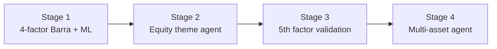
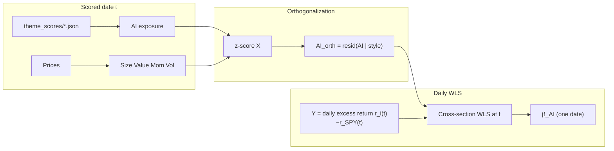
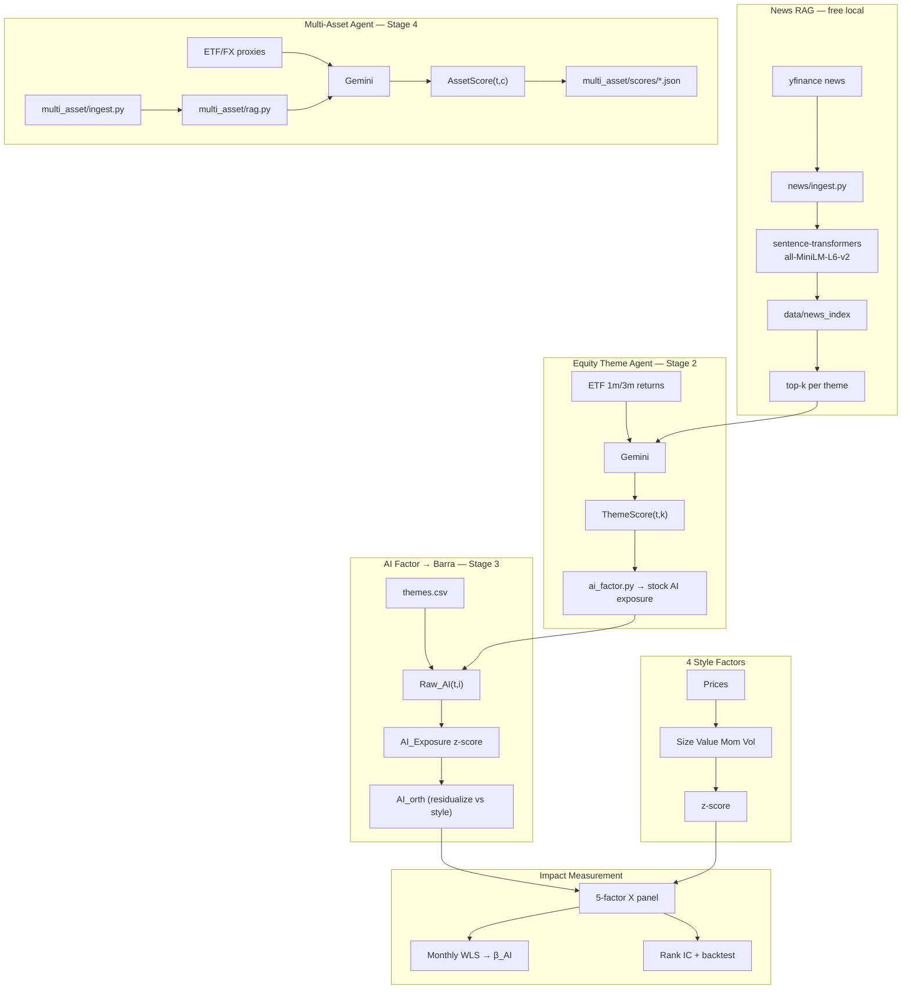
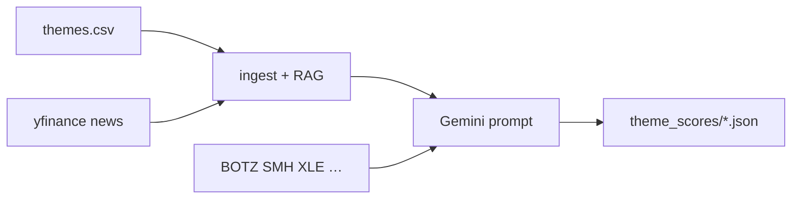
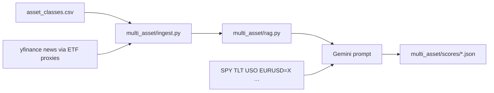

# AI Theme Factor Research

> **Motivation:** If LLM-generated views — grounded in news and market context — can help explain and rank **equity** returns, can the same agent + RAG pattern extend to **multi-asset** allocation (equities vs bonds vs commodities vs FX)? This repo tests that progression: first within stocks (Barra 5th factor), then across asset classes (`multi_asset/`).

**Can LLM + RAG-enhanced thematic views improve cross-sectional equity return explanation and stock ranking, beyond classical Barra style factors?**

This repo is a **research sandbox** for studying the **AI Theme Factor** — a 5th factor derived from Gemini theme scores (grounded in ETF momentum and RAG-retrieved news) and stock-theme mappings, embedded into a Barra-style multi-factor framework alongside Size, Value, Momentum, and Volatility. The **multi-asset agent** (Stage 4) applies the same signal stack one level up: asset-class scores instead of stock-level theme exposure.

The classical factor pipeline (WLS → ML → IC → long-short backtest) provides the **measurement infrastructure**. The research contribution is testing whether **AI-driven thematic signals** add incremental explanatory and predictive power — in equities first, then as a top-down allocation layer. See [Research History](#research-history) for how the project evolved in four stages.

> **Scope**: Educational / portfolio project. Not a production risk model. PnL figures are illustrative; research design and limitations are documented explicitly.

---

## Research History

**Starting question:** If AI-driven views can influence how we think about **stock** prices and cross-sectional equity returns, can we apply the same LLM + RAG pipeline to **multi-asset** decisions — which asset class to overweight (US equities vs EM, treasuries vs HY, gold vs oil, USD vs EUR)?

This project was built in four stages to answer that progression: establish a **4-factor baseline**, construct the **equity AI Theme Factor** signal stack, **test whether AI merits a 5th factor slot** within equities, then add a **multi-asset LLM agent** for top-down asset-class views.



### Stage 1 — Classical Barra + ML (4 factors)

**Goal:** Build the control framework before adding any AI signal.

| What | Detail |
|------|--------|
| Factors | **Size, Value, Momentum, Volatility** from prices (`features.py`) |
| Barra | Cross-sectional WLS factor returns (`barra.py`, `barra_panel.py`) |
| ML | Ridge / Random Forest on 4-factor panel; **Rank IC** + long-short backtest (`ml_predict.py`) |
| Baseline | 80/20 time split, 50 large caps, 2016–2026 — Ridge(4) beat Momentum-only OLS on test Rank IC |

This stage answers: *do the four style factors explain and rank returns in this universe?* That pipeline (WLS → ML → IC → backtest) became the **measurement infrastructure** for everything after.

### Stage 2 — AI Theme Factor construction (equity themes)

**Goal:** Turn LLM thematic views into a stock-level exposure series embeddable in Barra / ML.

| Layer | Module | Role |
|-------|--------|------|
| Stock–theme mapping | `themes.csv` | Weights: e.g. NVDA → 55% AI + 45% Semiconductors |
| News retrieval | `news/ingest.py`, `news/rag.py` | yfinance headlines → local MiniLM embedding → top-k per theme |
| Theme scoring | `theme_agent.py` | Gemini + ETF context + RAG news → `ThemeScore(t, k) ∈ [-1, +1]` |
| Persistence | `theme_scores/*.json` | Auditable daily scores + news citations |
| Stock exposure | `ai_factor.py` | `Raw_AI(i) = Σ weight(i,k) × ThemeScore(k)` → cached panel |

The AI Theme Factor is **not** a black-box stock picker — it is a **thematic view layer** mapped to names via `themes.csv`, then z-scored like style factors.

### Stage 3 — Validate AI as the 5th factor (in progress)

**Goal:** Test whether the **equity** AI Theme Factor adds **incremental** explanatory and predictive power beyond the Stage 1 baseline.

| Question | Approach | Status |
|----------|----------|--------|
| Factor premium **β_AI** | 5-factor WLS (4 style + AI) | ✅ daily snapshot in `barra.py` / `barra_panel.py` (Phase 1); 🔲 monthly + `AI_orth` in `barra_monthly.py` (Phase 2) |
| Orthogonality vs style | Exposure corr; residualize → **`AI_orth`** | 🔲 Phase 1 |
| Incremental **R²** | 4-factor vs 5-factor WLS | 🔲 Phase 1 |
| Incremental **Rank IC** | Ridge(4) vs Ridge(5) on test set | ✅ wired in `ml_predict.py` |
| LLM vs ETF proxy (H5) | Gemini+RAG vs `--mock` | 🔲 Phase 2 (needs more scored dates) |

**Constraint discovered in Stage 3:** no multi-year archive of Gemini theme scores → [Phase 1](#phase-1--daily-return-current-scope) uses **daily** return first (`barra_panel.py`); [Phase 2](#phase-2--monthly-return-planned) will switch to **monthly** rebalance and forward return.

### Stage 4 — Multi-asset agent (top-down asset classes)

**Goal:** Extend the same LLM + RAG + ETF/FX pattern from **equity themes** to **global asset-class allocation views** — a separate, top-down signal layer that does not map to individual stocks.

| Layer | Module | Role |
|-------|--------|------|
| Asset-class universe | `multi_asset/asset_classes.csv` | 19 classes across Broad, Equities, Fixed_Income, Commodities_FX |
| Macro news RAG | `multi_asset/ingest.py`, `multi_asset/rag.py` | Headlines via ETF proxies → local embedding → top-k per class |
| Asset-class scoring | `multi_asset/agent.py` | Gemini + ETF/FX context + RAG → `AssetScore(t, c) ∈ [-1, +1]` |
| Persistence | `multi_asset/scores/*.json` | Daily scores, `scores_by_category`, context, news citations |

**Universe (19 asset classes):**

| Category | Classes |
|----------|---------|
| **Broad** | Global_Equities, Global_Sovereign, Commodities, Currencies_USD |
| **Equities** | US_Equities, Eurozone_Equities, Japanese_Equities, Emerging_Markets |
| **Fixed_Income** | US_Treasuries, UK_Gilts, Eurozone_Sovereign, US_High_Yield, EM_Fixed_Income_USD |
| **Commodities_FX** | Oil, Copper, Gold, USD_vs_EUR, GBP_vs_EUR, USD_vs_JPY |

Scores are **cross-sectional within each category** (e.g. US vs Eurozone vs EM equities), not a single global ranking across bonds and FX.

**Design choices:**

- **One Gemini call per run** (all categories in one prompt) to conserve free-tier API quota; `--per-category` available for debugging.
- **429/503 retry** with backoff; `--model` flag to switch models when daily quota is exhausted.
- **`--mock`** baseline: ETF/FX 3-month momentum z-scored within category — same pattern as `theme_agent.py --mock`.

```bash
python multi_asset/agent.py                  # Gemini + RAG (1 API call)
python multi_asset/agent.py --mock           # no API key
python multi_asset/agent.py --model gemini-2.0-flash
```

**Relationship to Stage 2:** `theme_agent` scores *within-equity* themes (AI, Semiconductors, …); `multi_asset/agent` scores *across asset classes* (equities vs bonds vs commodities vs FX). The two layers are **orthogonal** and can be combined later (e.g. multi-asset risk budget → equity sleeve → theme tilt).

| Question | Approach | Status |
|----------|----------|--------|
| Multi-asset views vs mock | Gemini+RAG vs `--mock` on `multi_asset/scores/` | 🔲 exploratory (no backtest wired yet) |

**Constraint:** same as Stage 3 for theme scores — `multi_asset/scores/` is live/recent dates only for Gemini+RAG; use `--mock` for reproducible runs without API quota.

---

## Core Research Question

> *When an LLM agent scores investment themes (AI, Semiconductors, Energy, …) using ETF context and RAG-retrieved news, does mapping those scores to individual stocks — via thematic exposure weights — produce a factor that (a) earns a positive risk premium in WLS, (b) is orthogonal to Momentum, and (c) improves out-of-sample Rank IC when added to a 4-factor model?*

### Sub-questions

| # | Question | How we test it |
|---|----------|----------------|
| H1 | Does the AI Theme Factor have a positive **factor premium** (β_AI)? | **Phase 1:** daily cross-sectional 5-factor WLS (sign of β_AI on one date). **Phase 2:** mean β_AI over monthly rebalance dates |
| H2 | Is it **orthogonal** to classical factors? | Exposure corr matrix; **`AI_orth`** residualized vs. Size/Value/Mom/Vol |
| H3 | Does it add **incremental R²** over 4 factors? | Cross-sectional R²: 4-factor vs. 5-factor WLS on rebalance date(s) |
| H4 | Does it improve **stock ranking** (Rank IC)? | Ridge 4-factor vs. Ridge 5-factor on forward excess return |
| H5 | Does **Gemini + RAG** beat a naive **ETF-momentum** baseline? | Compare `theme_agent.py` vs. `--mock` scores |

---

## Research Roadmap (current plan)

We **cannot obtain historical LLM theme scores** (yfinance news has no archive; Gemini+RAG is live/recent only). **Phase 1** validates the pipeline on **daily** cross-sectional Barra WLS — factor exposures **X** and excess return **Y** on the same trading day, aligned with [`barra_panel.py`](barra_panel.py). **Phase 2** will move to **monthly** rebalance frequency and **monthly** forward excess return as **Y**, with a rolling β_AI time series.

| | Phase 1 (current) | Phase 2 (planned) |
|---|-------------------|-------------------|
| **Return horizon (Y)** | **Daily** excess return vs. SPY | **Monthly** cumulative excess return |
| **Rebalance** | Any scored trading day (snapshot) | First trading day of each month |
| **WLS** | One cross-section per date | Loop over month-starts |
| **Primary script** | `barra_panel.py` | `barra_monthly.py` (planned) |

### Phase 1 — daily return (current scope)

| Choice | Definition |
|--------|------------|
| **Why daily first** | Matches existing daily factor panel; fast sanity check before committing to monthly aggregation |
| As-of date | Any trading day with `theme_scores/*.json` (e.g. latest Gemini output) |
| AI signal | `ai_factor.py --mode auto` or `snapshot_exposure(as_of)` from saved JSON — **not** mock for this phase |
| **X** | Size, Value, Momentum, Volatility + AI at date `t` → cross-sectional z-score → optional **`AI_orth`** |
| **Y** | **Same-day daily** excess return: `r_i(t) − r_SPY(t)` |
| Estimation | One cross-sectional WLS per date: `β = (Xᵀ W X)⁻¹ Xᵀ W y` |
| Output | Single **β_AI** (and other factor returns), exposure corr before/after orth |

This is **methodology demo + sanity check**, not a t-stat on β_AI. One daily slice cannot prove a stable factor premium; it shows the pipeline works and whether AI adds anything **incremental to style on that day**.

```bash
# Typical Phase 1 flow
python theme_agent.py --date 2026-06-22    # ensure theme_scores/ exists
python ai_factor.py --date 2026-06-22 --mode auto
python barra_panel.py                      # daily X panel + single-date WLS (daily Y)
```

#### Latest Barra snapshot — 2026-06-22

--- the factor returns are estimated successfully ---
Size_Return: 0.005813
Value_Return: -0.001092
Momentum_Return: 0.011111
Volatility_Return: -0.003871
AI_Return: 0.014198

### Phase 2 — monthly return (planned)

| Track | Period | Return (Y) | AI signal | Purpose |
|-------|--------|------------|-----------|---------|
| **Long sample** | 2016–2026 | **Monthly** forward excess return | `ai_factor.py --mode mock` (ETF 3m theme proxy) | β_AI(t) series, orthogonality, ΔR² over many months |
| **Short sample** | Dates w/ `theme_scores/*.json` | **Monthly** forward excess return | `--mode auto` | H5: Gemini+RAG vs mock on the same dates |

Rebalance on **month-start**; **Y** = cumulative excess return over the holding month (or next month — pick one and document). Loop all month-starts in `START_DATE`–`END_DATE` for β_AI mean and t-stat.

Do **not** label mock long-sample results as “LLM alpha”. Phase 2 long track validates **framework + proxy**; Gemini value-add stays on scored dates only.

### Monthly Barra (`barra_monthly.py` — planned, Phase 2)

Keep [`barra.py`](barra.py) and [`barra_panel.py`](barra_panel.py) as **daily** demos. Add **`barra_monthly.py`** for **Phase 2** monthly rebalance + monthly **Y**.

| Choice | Phase 1 (daily) | Phase 2 (monthly) |
|--------|-----------------|-------------------|
| Dates | One or few trading days | All month-starts in `START_DATE`–`END_DATE` |
| **Y** | Same-day daily excess return | Monthly cumulative excess return |
| AI | Gemini JSON via `auto` | Mock long history + Gemini where available |
| Output | β vector per date | β_AI(t) series, mean, t-stat |

Reuse [`features.py`](features.py), [`ai_factor.py`](ai_factor.py), and the WLS formula from [`barra.py`](barra.py).

### AI orthogonalization (planned)

Theme scores (mock or Gemini) overlap **Momentum** and other style factors. Before WLS, residualize AI on the **cross-section at date** `t` (daily in Phase 1; month-start in Phase 2):

```
AI_orth(i,t) = AI(i,t) − α(t) − γ(t)ᵀ · [Size, Value, Momentum, Volatility](i,t)
```

Then z-score `AI_orth` cross-sectionally and use it as the 5th column of **X** (replacing raw AI).

| Step | Action |
|------|--------|
| 1 | Build raw style factors + raw AI exposure at date `t` |
| 2 | Cross-sectional z-score all columns |
| 3 | OLS: `AI ~ Size + Value + Momentum + Volatility` (with intercept) → residuals |
| 4 | Z-score residuals → `AI_orth` |
| 5 | WLS with `[Size, Value, Momentum, Volatility, AI_orth]` |

**Why:** Multivariate WLS already gives a partial β_AI, but correlated exposures make estimates unstable. Orthogonalization makes **H2** explicit (`corr(AI_orth, Momentum) ≈ 0`) and clarifies that β_AI is **incremental to style**, not a momentum re-label.

Report both: (a) exposure correlation matrix **before** orthogonalization, (b) WLS results **after** `AI_orth`.

### End-to-end workflow — Phase 1 (daily return)



Phase 2 adds: month-start rebalance → **monthly Y** → loop → β_AI(t) series → t-stat (`barra_monthly.py`).

### Script roles (after roadmap)

| Script | Role |
|--------|------|
| `barra.py` | Single-day WLS snapshot / teaching demo (daily Y) |
| `barra_panel.py` | **Phase 1** — daily factor panel + single-date WLS |
| **`barra_monthly.py`** | **Phase 2 (planned)** — monthly rebalance, monthly Y, rolling β series |
| `ml_predict.py` | OOS Rank IC; optionally swap in `AI_orth` for Ridge(5) |

---

## The AI Theme Factor

### Definition

**Step 1 — Theme scores** (daily, cross-sectional view on themes):

```
ThemeScore(t, k) ∈ [-1, +1]     # Gemini + RAG + ETF context, or --mock proxy
```

**Step 2 — Stock thematic exposure** (from `themes.csv`):

```
Raw_AI(t, i) = Σ_k  weight(i, k) × ThemeScore(t, k)
```

Each stock can map to multiple themes with weights summing to 1. Example: NVDA → 55% AI + 45% Semiconductors.

**Step 3 — Cross-sectional standardization** (same as style factors):

```
AI_Exposure(t, i) = z-score_i( Raw_AI(t, ·) )
```

**Step 3b — Orthogonalization** (optional in Phase 1 daily WLS; standard in Phase 2 monthly Barra):

```
AI_orth(t, i) = AI_Exposure(t, i) − projection onto [Size, Value, Momentum, Volatility] at t
```

**Step 4 — Embed in Barra WLS** as the 5th column of X:

```
r_i − r_SPY ≈ β_Size·X_Size + β_Value·X_Value + β_Mom·X_Mom + β_Vol·X_Vol + β_AI·X_AI_orth + ε_i
```

A positive, stable **β_AI** on **AI_orth** means thematic exposure earns excess returns **after removing overlap with classical style factors**.

### Why themes + LLM + RAG?

| Layer | Role |
|-------|------|
| **RAG (local)** | Retrieve theme-relevant news headlines — free, no embedding API |
| **Gemini** | Synthesize ETF momentum + news into theme scores |
| **`themes.csv`** | Map theme views to stock exposures |
| **Barra WLS / ML** | Measure incremental premium and Rank IC |

The pipeline separates **information retrieval** (RAG), **view generation** (Gemini), **position mapping** (weights), and **factor estimation** (WLS) — each step is auditable.

---

## Research Architecture



### Implementation status

| Component | Status | Module |
|-----------|--------|--------|
| Stock-theme mapping (50 stocks × 10 themes) | ✅ Done | `themes.csv` |
| yfinance news ingest per theme | ✅ Done | `news/ingest.py` |
| Local RAG (free embedding + retrieval) | ✅ Done | `news/rag.py` |
| Gemini scoring + RAG in prompt | ✅ Done | `theme_agent.py` |
| ETF-momentum baseline (`--mock`) | ✅ Done | `theme_agent.py` |
| Daily score + news citation persistence | ✅ Done | `theme_scores/*.json` |
| Stock AI exposure panel | ✅ Done | `ai_factor.py` |
| Mock theme score panel (full history) | ✅ Done | `ai_factor.py` (`--mode mock`) |
| **Multi-asset universe (19 classes)** | ✅ Done | `multi_asset/asset_classes.csv` |
| **Macro news RAG per asset class** | ✅ Done | `multi_asset/ingest.py`, `multi_asset/rag.py` |
| **Multi-asset Gemini agent + mock** | ✅ Done | `multi_asset/agent.py` |
| **Daily multi-asset score persistence** | ✅ Done | `multi_asset/scores/*.json` |
| Daily 5-factor WLS snapshot | ✅ Done | `barra.py` |
| Daily factor panel + WLS | ✅ Done | `barra_panel.py` |
| 5-factor ML + Rank IC | ✅ Done | `ml_predict.py` |
| **Single-month Barra WLS + AI_orth** | 🔲 Planned (Phase 2) | `barra_monthly.py` |
| **Monthly Barra loop + β_AI time series** | 🔲 Planned (Phase 2) | `barra_monthly.py` |
| **AI orthogonalization vs style factors** | 🔲 Phase 1 optional / Phase 2 standard | `barra_panel.py` / `barra_monthly.py` |
| Ridge(5) with `AI_orth` (incremental Rank IC) | 🔲 Planned | `ml_predict.py` |
| **Multi-asset score → allocation backtest** | 🔲 Exploratory | — |

---

## News RAG Pipeline (free — no paid embedding API)

### `news/ingest.py` — collect headlines

1. Look up tickers per theme from `themes.csv` (e.g. AI → NVDA, MSFT, AMD…)
2. Fetch recent headlines via `yfinance.Ticker(t).news`
3. Deduplicate by title; filter to `NEWS_LOOKBACK_DAYS` (default 7) before `as_of`

### `news/rag.py` — retrieve top-k per theme

1. Embed headlines with **local** `sentence-transformers` (`all-MiniLM-L6-v2`)
2. Query each theme: `"{theme} sector investment outlook stock market news"`
3. Cosine similarity → top-`NEWS_RAG_TOP_K` (default 5) articles per theme
4. Cache index under `data/news_index/YYYY-MM-DD/` (JSON + `.npy` vectors)

```bash
python news/ingest.py    # smoke test: fetch headlines
python news/rag.py       # build index + print retrieval results
```

**Cost**: embedding runs locally after first model download — no OpenAI/Gemini embedding API.

**Limitation**: yfinance news has no full historical archive; RAG is for **live / recent** scoring. Historical backtests use `--mock` ETF proxy scores.

---

## Theme Agent (`theme_agent.py`)

Combines **ETF context**, **RAG news**, and **Gemini** to produce daily theme scores.

### Workflow



1. Fetch ETF proxy returns (1m / 3m) per theme
2. Build or load cached RAG index; retrieve top-k news per theme
3. Prompt Gemini with ETF data + headlines
4. Save JSON with `scores`, `context`, and `news_sources`

### CLI

```bash
python theme_agent.py                  # Gemini + RAG + ETF (default)
python theme_agent.py --date 2026-06-19
python theme_agent.py --no-news        # Gemini + ETF only (A/B vs RAG)
python theme_agent.py --rebuild-news   # force rebuild news index
python theme_agent.py --mock           # ETF proxy baseline, no API key
```

Requires `GEMINI_API_KEY` in `.env` (see `.env.example`). Use API model ID in `config.py` (e.g. `gemini-2.5-flash-lite`), not the UI display name.

### Example output (`theme_scores/2026-06-19.json`, source: `gemini_rag`)

| Theme | Score | Notes |
|-------|-------|-------|
| Semiconductors | **+0.80** | Bullish; strong SMH momentum |
| Industrials | +0.60 | |
| Energy | **−0.60** | Bearish; weak XLE |
| Media | −0.40 | |
| Software | 0.00 | Neutral despite positive ETF — Gemini ≠ pure momentum |

JSON also includes `news_sources` with cited headlines per theme for interview demos.

### Baseline for H5

`--mock` z-scores ETF 3-month returns across themes → [-1, +1]. If Gemini+RAG cannot beat mock on Rank IC or β_AI stability, the LLM layer adds no value over naive theme momentum.

---

## Multi-Asset Agent (`multi_asset/`)

Top-down **asset-class** scoring — parallel to the equity theme agent, using the same LLM + RAG + market-context pattern.

### Workflow



1. Load 19 asset classes from `multi_asset/asset_classes.csv` (ETF/FX proxy per class)
2. Fetch ETF proxy returns (1m / 3m) and macro news via proxies
3. Build or load cached RAG index under `multi_asset/data/news_index/`
4. **Single Gemini call** scores all classes (within-category cross-section)
5. Save JSON with `scores`, `scores_by_category`, `context`, `news_sources`

### CLI

```bash
python multi_asset/agent.py                  # Gemini + RAG (1 API call)
python multi_asset/agent.py --date 2026-06-23
python multi_asset/agent.py --mock           # ETF/FX momentum proxy, no API key
python multi_asset/agent.py --no-news        # Gemini + market context only
python multi_asset/agent.py --model gemini-2.0-flash   # switch model if quota exhausted
python multi_asset/agent.py --per-category   # 4 API calls (debug only)
```

Requires `GEMINI_API_KEY` in `.env`. Free tier is ~20 requests/day per model — use `--mock` or `--model` when quota is hit.

---

## AI Factor in Barra (integrated)

Theme scores map to stocks via [`ai_factor.py`](ai_factor.py) and merge with style factors in [`features.py`](features.py):

```python
# Long history: mock ETF proxy
python ai_factor.py --mode mock --rebuild

# Recent dates: Gemini JSON when present, else mock
python ai_factor.py --mode auto --rebuild

# Panel used by barra_panel.py / ml_predict.py
ai_panel = build_ai_panel(dates=returns.index, mode="mock")
x_panel = zscore_cross_section(build_factor_panel(returns, close, ai_panel=ai_panel))
```

**Next:** Phase 1 uses [`barra_panel.py`](barra_panel.py) (daily Y). Phase 2 will add [`barra_monthly.py`](barra_monthly.py) — monthly rebalance, monthly forward excess return, `AI_orth` (see [Research Roadmap](#research-roadmap-current-plan)).

---

## Foundation Pipeline

The 4-factor Barra + ML stack is the **control framework** against which AI Theme Factor impact is measured.

### Style factors (4)

| Factor | Construction |
|--------|--------------|
| Size | `ln(price)` |
| Value | `book_per_share / price` (P/B proxy) |
| Momentum | 63d cumulative return, skip last 5d |
| Volatility | 20d rolling return std |

### WLS factor returns

```
β = (Xᵀ W X)⁻¹ Xᵀ W y        W = diag(ln(marketCap))
```

### ML alpha (4-factor baseline results)

Chronological 80/20 split, 50 large caps, 2016–2026:

```
                          mean_ic  mean_rank_ic  sharpe
Ridge (4 factors)          0.0730        0.0546    1.95
Momentum only (OLS)        0.0246        0.0216    0.80
Baseline (predict 0)          NaN           NaN   -1.86
```

**This is the bar the 5-factor model must beat.**

### Entry points

| Script | Role |
|--------|------|
| `news/ingest.py` | Fetch yfinance news per theme |
| `news/rag.py` | Local embedding RAG index + retrieval |
| `theme_agent.py` | **Signal** — Gemini + RAG equity theme scores |
| `multi_asset/agent.py` | **Signal** — Gemini + RAG asset-class scores |
| `barra_panel.py` | Daily factor panel + WLS |
| `barra_monthly.py` | **Planned (Phase 2)** — monthly rebalance + monthly Y |
| `ml_predict.py` | ML comparison + Rank IC + backtest |
| `barra.py` | Single-day static WLS demo (unchanged) |
| `backtest.py` | Long-short portfolio simulation |

---

## How We Measure AI Theme Factor Impact

| Test | Metric | Module | Phase |
|------|--------|--------|-------|
| H1 Factor premium | **β_AI** from daily 5-factor WLS cross-section | `barra_panel.py` | 1 |
| H2 Orthogonality | `corr(AI, Momentum)` before orth; **`corr(AI_orth, Momentum) ≈ 0`** after | `barra_panel.py` / `barra_monthly.py` | 1+ |
| H3 Incremental R² | `R²(5-factor) − R²(4-factor)` on rebalance date | `barra_panel.py` | 1 |
| H4 Predictive power | Test **Rank IC**: Ridge(5) vs Ridge(4) | `ml_predict.py` | 1+ |
| H5 LLM value-add | Gemini+RAG vs `--mock` on same dates | `theme_agent.py` | 2 |
| H1 (extended) | Mean **β_AI**, t-stat over **monthly** rebalance dates | `barra_monthly.py` | 2 |

---

## Project Structure

```
ai_factor_barra/
│
├── config.py                 # Global settings: universe, dates, factor names, RAG/agent params
├── env_loader.py             # Load GEMINI_API_KEY from .env
├── .env.example              # API key template (copy to .env)
├── requirements.txt
├── .gitignore
│
├── themes.csv                # Stock → theme exposure weights (50 stocks × 10 themes)
│
├── theme_agent.py            # Gemini + RAG + ETF → daily equity theme scores
├── theme_scores/             # Persisted theme score JSON (scores, context, news_sources)
│   └── YYYY-MM-DD.json
│
├── multi_asset/              # Multi-asset LLM agent (Stage 4)
│   ├── asset_classes.csv     # 19 asset classes + ETF/FX proxies
│   ├── universe.py           # Load universe, category grouping
│   ├── ingest.py             # Macro news via ETF proxies
│   ├── rag.py                # Local embedding RAG per asset class
│   ├── agent.py              # Gemini + RAG → daily asset-class scores
│   ├── scores/               # Persisted multi-asset score JSON
│   │   └── YYYY-MM-DD.json
│   └── data/news_index/      # RAG cache (gitignored)
│
├── news/                     # Free local news RAG (no paid embedding API)
│   ├── __init__.py
│   ├── ingest.py             # Fetch yfinance headlines per theme
│   └── rag.py                # sentence-transformers embed + cosine retrieval
│
├── ai_factor.py              # Theme scores → stock-level AI exposure panel
├── features.py               # Style factors (Size/Value/Mom/Vol) + cross-section z-score
│
├── barra.py                  # Single-day 5-factor WLS demo (static X from yfinance info)
├── barra_panel.py            # Rolling daily factor panel + 5-factor WLS
├── barra_monthly.py          # (planned, Phase 2) monthly rebalance WLS + AI orth
├── ml_predict.py             # Ridge/RF models, Rank IC, long-short backtest
├── backtest.py               # Long-short portfolio simulation (used by ml_predict)
│
└── data/                     # Generated caches (gitignored)
    ├── news_index/           # Equity theme RAG embeddings per as-of date
    │   └── YYYY-MM-DD/
    └── ai_exposure_panel.parquet   # (date, ticker) × AI raw exposure panel
```

### Module roles

| Path | Role |
|------|------|
| `themes.csv` | Static stock–theme weights; input to AI exposure mapping |
| `theme_agent.py` | **Equity signal** — LLM theme scores with RAG + ETF context |
| `theme_scores/` | Auditable archive of daily Gemini/mock equity theme scores |
| `multi_asset/asset_classes.csv` | 19 global asset classes with ETF/FX proxies |
| `multi_asset/agent.py` | **Multi-asset signal** — LLM asset-class scores (1 API call/run) |
| `multi_asset/scores/` | Auditable archive of daily Gemini/mock asset-class scores |
| `multi_asset/ingest.py` | Pull yfinance news via ETF proxies per asset class |
| `multi_asset/rag.py` | Local embedding index + top-k retrieval per asset class |
| `news/ingest.py` | Pull and normalize yfinance news by equity theme |
| `news/rag.py` | Local embedding index + top-k retrieval per theme |
| `ai_factor.py` | Map theme scores → per-stock `Raw_AI`; cache parquet panel |
| `features.py` | Build 4 style factors; merge AI panel; z-score cross-section |
| `barra.py` | Quick single-date WLS including `AI_Return` (demo only) |
| `barra_panel.py` | Daily factor panel + single-date WLS |
| `barra_monthly.py` | **Planned (Phase 2)** — monthly rebalance, monthly Y, β time series |
| `ml_predict.py` | ML alpha test: Ridge(4) vs Ridge(5), Rank IC, backtest |
| `backtest.py` | Monthly long-short simulation helpers |
| `config.py` | `FACTOR_NAMES`, dates, `AI_SCORE_MODE`, RAG + multi-asset params |
| `data/news_index/` | Cached equity theme RAG vectors |
| `multi_asset/data/news_index/` | Cached multi-asset RAG vectors |
| `data/ai_exposure_panel.parquet` | Cached AI panel for `barra_panel` / `ml_predict` |

### Recommended run order

```bash
# 1a. Equity theme scoring (optional — skip if using --mode mock)
python theme_agent.py --date YYYY-MM-DD

# 1b. Multi-asset scoring (optional — parallel top-down layer)
python multi_asset/agent.py --date YYYY-MM-DD

# 2. Build AI exposure panel
python ai_factor.py --mode auto --rebuild    # Gemini JSON where available, else mock
# python ai_factor.py --mode mock --rebuild  # full-history mock baseline

# 3. Factor research (any order)
python barra.py              # single-day WLS snapshot (demo, daily Y)
python barra_panel.py        # Phase 1: daily panel + WLS
python barra_monthly.py      # (planned, Phase 2) monthly WLS + AI orth
python ml_predict.py         # ML comparison + Rank IC
```

---

## Setup & Run

```bash
python3 -m venv .venv && source .venv/bin/activate
pip install -r requirements.txt

cp .env.example .env
# GEMINI_API_KEY=...  https://aistudio.google.com/apikey

# --- AI Theme signal (equity) ---
python news/rag.py                 # build local RAG index (optional standalone test)
python theme_agent.py              # Gemini + RAG + ETF → theme_scores/
python theme_agent.py --mock       # reproducible baseline, no API key

# --- Multi-asset signal (top-down) ---
python multi_asset/agent.py        # Gemini + RAG → multi_asset/scores/
python multi_asset/agent.py --mock # ETF/FX proxy baseline, no API key

# --- Factor research ---
python barra_panel.py              # Phase 1: daily panel + WLS
python barra_monthly.py            # (planned, Phase 2) monthly WLS + AI orth
python ml_predict.py                 # ML + Rank IC (Ridge 4 vs 5)
```

First run downloads `all-MiniLM-L6-v2` (~80 MB) for local embedding. `ml_predict.py` first run is slow (50 tickers × yfinance info for Value factor).

---

## Configuration

| Parameter | Default | Role |
|-----------|---------|------|
| `THEMES_FILE` | `themes.csv` | Stock-theme exposure weights |
| `GEMINI_MODEL` | `gemini-2.5-flash-lite` | LLM for theme scoring |
| `THEME_ETF_PROXY` | BOTZ, SMH, … | ETF context in agent prompt |
| `THEME_SCORES_DIR` | `theme_scores` | Daily score archive |
| `NEWS_LOOKBACK_DAYS` | 7 | News date filter |
| `NEWS_RAG_TOP_K` | 5 | Headlines per theme in prompt |
| `EMBEDDING_MODEL` | `all-MiniLM-L6-v2` | Local RAG embedding (free) |
| `NEWS_INDEX_DIR` | `data/news_index` | RAG cache |
| `FACTOR_NAMES` | 5 factors incl. `"AI"` | Style + AI exposure |
| `REBALANCE_FREQ` | `monthly` | Aligns with `barra_monthly.py` and `backtest.py` |
| `AI_SCORE_MODE` | `auto` | `mock` for long history; `auto` uses Gemini JSON when present |
| `FORWARD_DAYS` | 5 | ML label horizon |
| `ASSET_CLASSES_FILE` | `multi_asset/asset_classes.csv` | Multi-asset universe |
| `MULTI_ASSET_SCORES_DIR` | `multi_asset/scores` | Daily asset-class score archive |
| `MULTI_ASSET_NEWS_INDEX_DIR` | `multi_asset/data/news_index` | Multi-asset RAG cache |

---

## Known Limitations

| Issue | Impact | Mitigation |
|-------|--------|------------|
| Static `themes.csv` | Business models don't evolve in data | Point-in-time tags in production |
| yfinance news not historical | RAG only for recent/live dates | `--mock` for backtest panel |
| Generic headlines in RAG | "Stocks rally" hits many themes | Theme-specific tickers + semantic query |
| No historical theme scores | Cannot run multi-month Gemini backtest yet | **Phase 1:** daily WLS with saved JSON; **Phase 2:** mock long panel + monthly |
| Gemini free-tier quota | ~20 req/day per model; theme + multi-asset agents share quota | Single-call design in `multi_asset/agent.py`; `--mock` or `--model` fallback |
| Theme ↔ Momentum overlap | AI factor may duplicate Mom | Orthogonalize → `AI_orth` before WLS |
| Single-day β_AI (Phase 1) | Not statistically conclusive | Treat as pipeline validation; extend to monthly in Phase 2 |
| 50-stock universe | Noisy β_AI | Focus on methodology in interviews |
| Single ML train/test split | One-regime OOS | Walk-forward as extension |

---

## Interview Talking Points

**Elevator pitch (30 sec):**

> I built a Barra-style pipeline in four stages: (1) **4-factor Barra + ML baseline**; (2) **equity AI Theme Factor** — `themes.csv` + RAG + Gemini theme agent → stock-level AI exposure; (3) **5th-factor validation** — does equity AI add incremental β, R², and Rank IC beyond style factors?; (4) **multi-asset agent** — same LLM+RAG pattern for 19 global asset classes (equities, bonds, commodities, FX).

**Expected questions:**

- **What is the AI Theme Factor?** `Σ weight(i,theme) × ThemeScore(theme)`, z-scored, embedded as a 5th Barra factor — not a black-box stock picker.
- **What is the multi-asset agent?** Top-down Gemini scores on 19 asset classes (Broad / Equities / Fixed_Income / Commodities_FX), saved to `multi_asset/scores/` — orthogonal to the equity theme layer.
- **How does RAG work here?** yfinance headlines → local MiniLM embedding → cosine retrieval per theme or asset class → top headlines in Gemini prompt. No paid embedding API.
- **How do you backtest without history?** Phase 1: daily WLS on dates where `theme_scores/*.json` exists (`barra_panel.py`). Phase 2: `--mock` ETF proxy + **monthly** rebalance — not claimed as LLM alpha.
- **What if AI correlates with Momentum?** Cross-sectional regression → `AI_orth`, then WLS; report corr before and after.
- **What's next?** Phase 2 `barra_monthly.py` — month-start rebalance, **monthly** forward excess return, β_AI time series; later wire multi-asset scores into allocation backtest.

---

## License

Personal / educational use.
