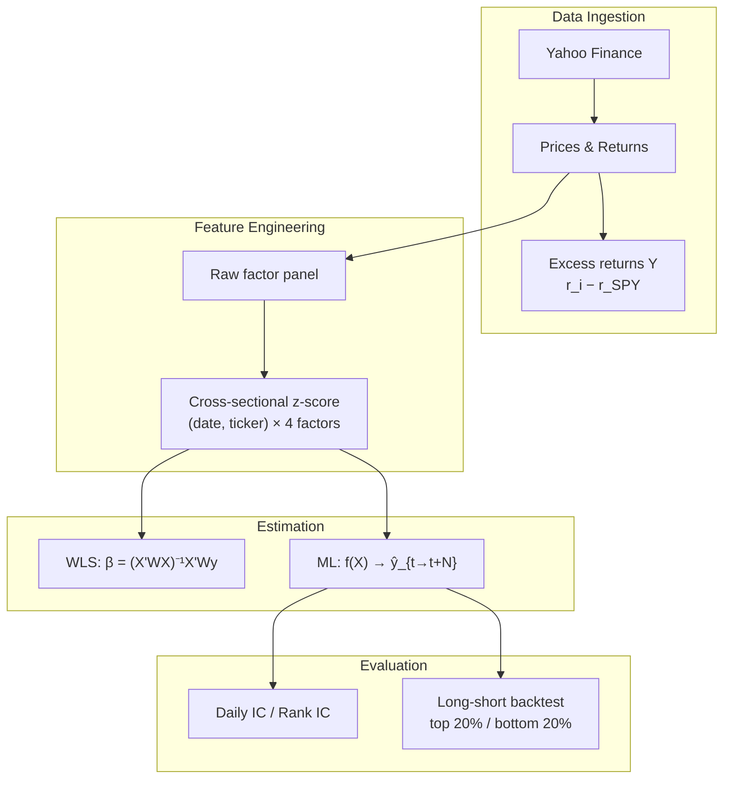
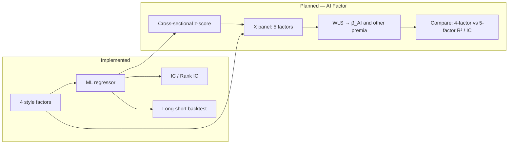

# Equity Factor ML

**A cross-sectional factor research pipeline**: Barra-style style factors → WLS factor return estimation → machine-learning alpha prediction → information coefficient (IC) evaluation and long-short backtesting.

Built as a **research sandbox** for exploring how classical factor exposures can be combined with ML to forecast forward excess returns — the kind of end-to-end workflow common in systematic equity research.

> **Scope**: Educational / portfolio project. Not a production risk model. Limitations are documented explicitly below.

> **Roadmap**: An **AI factor** (5th style factor from ML predictions, fed back into WLS) is planned but **not yet implemented**. See [Planned: AI Factor](#planned-ai-factor) below.

---

## Research Question

> *Can standardized style-factor exposures predict forward cross-sectional excess returns, and does a simple ML layer improve stock-ranking ability over a single-factor baseline?*

The pipeline answers this in three stages:

1. **Factor model** — Estimate daily factor premia via weighted least squares (WLS).
2. **Alpha model** — Train regressors on factor exposures to predict N-day forward excess return.
3. **Portfolio test** — Translate predictions into a dollar-neutral long-short book and measure IC, Rank IC, and PnL statistics out-of-sample.

A fourth stage — treating the ML signal as a tradable **AI factor** inside the Barra framework — is the intended next step (not built yet).

---

## Architecture



### Entry points (increasing complexity)

| Script | Role | Target variable |
|--------|------|-----------------|
| `barra.py` | Static cross-section WLS demo | Same-day excess return |
| `barra_panel.py` | Daily rolling factor panel + WLS on last day | Same-day excess return |
| `ml_predict.py` | Full ML pipeline + model comparison + backtest | Forward N-day excess return |

---

## Project Structure

```
equity_factor_ml/
├── config.py        # Universe, dates, factor windows, ML & backtest params
├── features.py      # Rolling factor computation + cross-sectional z-score
├── barra.py         # Snapshot WLS (quick Barra mechanics demo)
├── barra_panel.py   # Time-series factor panel + WLS
├── ml_predict.py    # Dataset build, train/test split, model comparison
├── backtest.py      # Long-short portfolio simulation + rebalance log
└── README.md
```

---

## Methodology

### Universe & returns

- **Universe**: 50 liquid large-cap names (S&P 500 subset), configurable in `config.py`
- **Benchmark**: `SPY`
- **Excess return**: `y_excess(t,i) = r_stock(t,i) − r_SPY(t)`
- **Sample period**: 2016-01-01 → 2026-06-16 (default)

### Style factors (4)

Daily rolling exposures in `features.py`, z-scored cross-sectionally each day:

| Factor | Construction | Notes |
|--------|--------------|-------|
| **Size** | `ln(price)` | Price proxy for market cap in panel mode |
| **Value** | `book_per_share / price` | B/P proxy from current P/B × daily price |
| **Momentum** | Cumulative return over 63d, skip last 5d | Classic 12-1 style window |
| **Volatility** | 20d rolling std of daily returns | Low-vol anomaly exposure |

`barra.py` uses point-in-time `yfinance` snapshots for Size/Value (`ln(marketCap)`, `1/PB`) — useful for understanding WLS mechanics, not for production alpha.

### WLS factor return estimation

On a chosen date `t`, solve the cross-sectional regression:

```
β = (Xᵀ W X)⁻¹ Xᵀ W y
```

- `X ∈ ℝ^{N×M}`: standardized factor exposures
- `y ∈ ℝ^N`: excess returns
- `W = diag(ln(marketCap))`: capitalization weights (simplified; institutional Barra models typically use √cap)

`barra_panel.py` aligns `X` and `y` to the same ticker set before regression — some names drop out when Value data is missing.

### ML alpha model

**Features**: z-scored factor panel at date `t`  
**Label**: arithmetic sum of forward excess returns over `FORWARD_DAYS` (default 5):

```
target_{N}d(t,i) = Σ_{k=1}^{N} y_excess(t+k, i)
```

**Train/test split**: chronological, 80/20 by trading date — no random shuffle (avoids look-ahead bias).

**Models compared**:

| Model | Purpose |
|-------|---------|
| Baseline (ŷ = 0) | Null ranking benchmark |
| Momentum OLS | Single-factor linear baseline |
| Ridge (4 factors) | Regularized multi-factor linear model |
| RandomForest (4 factors) | Non-linear ensemble (`max_depth=3`) |

### Evaluation framework

**Primary metric — Mean Rank IC** (Spearman correlation between predictions and realized forward returns, averaged across test-set dates). Rank IC is the standard cross-sectional alpha metric in systematic equity research because it measures *ordering* ability, not level forecasting accuracy.

**Secondary metrics**:

| Metric | Definition |
|--------|------------|
| Mean IC | Daily Pearson(pred, actual), time-averaged |
| MSE | Global mean squared error on test set |
| Ann Return | Annualized long-short return |
| Sharpe | Annualized Sharpe on daily LS returns |
| Max Drawdown | Peak-to-trough on cumulative LS equity |
| Hit Rate | Fraction of days with positive LS PnL |

### Long-short backtest (`backtest.py`)

Portfolio construction on the **test set only**:

1. At each rebalance date, rank stocks by model prediction `pred`
2. **Long** top `TOP_PCT` (20%), **short** bottom 20%, equal-weighted
3. Hold until next rebalance; daily PnL = mean(long `ret_1d`) − mean(short `ret_1d`) − costs
4. Default: monthly rebalance (first trading day of month); `COST_BPS = 0`

**Design note**: ML label uses a 5-day forward horizon; backtest PnL uses next-day excess return (`ret_1d`) with monthly rebalancing. This is a deliberate simplification — in production, label horizon, holding period, and rebalance frequency should be aligned.

`long_short_backtest()` returns `(daily_ls, holdings_df)` with per-rebalance position logs (`date`, `side`, `ticker`, `pred`).

---

## Results (default config, out-of-sample test set)

`START_DATE = 2016-01-01`, 50 tickers, monthly rebalance, zero transaction costs:

```
--- ML dataset ---
Rows: 122784 | Features: ['Size', 'Value', 'Momentum', 'Volatility']
Label:  forward 5-day excess return
Train:  98208 rows (through 2024-05-21)
Test:   24576 rows (from 2024-05-22)

--- Model comparison (test set) ---
                          mean_ic  mean_rank_ic  ann_return  sharpe  max_drawdown  hit_rate
Ridge (4 factors)          0.0730        0.0546      0.5787  1.9521       -0.2023    0.5586
RandomForest (4 factors)   0.0197        0.0373      0.3174  1.4142       -0.1906    0.5430
Momentum only (OLS)        0.0246        0.0216      0.2193  0.8045       -0.2722    0.5391
Baseline (predict 0)          NaN           NaN     -0.2166 -1.8575       -0.4113    0.4531
```

**How to read this**:

- Ridge achieves **Rank IC ≈ 0.055** — modest but directionally meaningful for a 50-stock universe with free data and no neutralization.
- Linear multi-factor model beats single-factor Momentum and non-linear RandomForest on Rank IC — suggests signal is largely linear in these features, or RF is underfit/overfit relative to sample size.
- Backtest returns are **gross of costs** on a small, survivorship-biased universe over a short OOS window — treat PnL as illustrative, not investable.

---

## Setup & Run

**Requirements**: Python 3.11+, `yfinance`, `pandas`, `numpy`, `scikit-learn`

```bash
python3 -m venv .venv
source .venv/bin/activate
pip install yfinance pandas numpy scikit-learn

python barra.py          # WLS demo (~seconds)
python barra_panel.py    # Factor panel + WLS
python ml_predict.py     # Full pipeline (~minutes on first run)
```

First run with 50 tickers is slow: bulk price download plus per-ticker `yfinance` info calls for the Value factor.

---

## Configuration (`config.py`)

| Parameter | Default | Description |
|-----------|---------|-------------|
| `TICKERS` | 50 large caps | Stock universe |
| `BENCHMARK` | `SPY` | Excess return benchmark |
| `START_DATE` / `END_DATE` | 2016 → 2026 | Data window |
| `LOOKBACK_MOM` / `SKIP_RECENT` | 63 / 5 | Momentum window |
| `LOOKBACK_VOL` | 20 | Volatility window |
| `FORWARD_DAYS` | 5 | ML label horizon |
| `TRAIN_RATIO` | 0.8 | Chronological train fraction |
| `TOP_PCT` | 0.2 | Long/short leg size |
| `COST_BPS` | 0 | One-way cost on rebalance days |
| `REBALANCE_FREQ` | `monthly` | `monthly` or `daily` |

---

## Planned: AI Factor

**Status: not implemented.** The current codebase stops at standalone ML alpha (`ml_predict.py`). The AI factor layer is the main item on the roadmap.

### Concept

In institutional quant research, ML output is often embedded into a multi-factor risk/return framework rather than traded in isolation. The planned **AI factor** would be:

```
AI_Exposure(t, i) = z-score_cross_section( ŷ(t, i) )
```

where `ŷ(t, i)` is the out-of-sample ML prediction of forward excess return for stock `i` on date `t`. After cross-sectional standardization, this exposure joins the existing four style factors as a **5th column in X**, and WLS estimates its daily factor premium:

```
r_i − r_SPY ≈ β_Size·X_Size + … + β_AI·X_AI + ε_i
```

### Intended workflow



### Implementation sketch (where it would live)

| Step | Module | Change |
|------|--------|--------|
| Walk-forward ML predictions | `ml_predict.py` or new `ai_factor.py` | Generate OOS `ŷ(t,i)` per date — no full-sample fit |
| Build AI exposure panel | `features.py` | `compute_ai_factor(predictions)` → z-scored column |
| Extend factor universe | `config.py` | `FACTOR_NAMES` → add `"AI"` |
| WLS with 5 factors | `barra_panel.py` | Regress on extended `X`; report `AI_Return` |
| Evaluation | new or `ml_predict.py` | Incremental Rank IC, factor correlation with Momentum/Value, subperiod stability |

### Research questions the AI factor would answer

- Does `β_AI` have a stable positive premium out-of-sample?
- Is the AI signal orthogonal to classical factors, or does it overlap with Momentum?
- Does adding AI to WLS improve cross-sectional R² beyond the 4-factor model?
- Does walk-forward AI exposure improve long-short Sharpe vs. direct prediction ranking?

### Why it's not in the repo yet

- Requires **walk-forward** prediction (a single train/test split would leak future model state into earlier WLS dates).
- Need to decide: same model as `ml_predict.py` (Ridge), or a dedicated model for factor embedding?
- Factor correlation and turnover need to be checked before treating AI as a style exposure.

This is deliberately documented as planned work — useful to discuss in interviews as *"here's what I built, here's what I'd add next, and here's why the sequencing matters."*

---

## Known Limitations (and what I'd fix next)

Demonstrates research judgment — important for quant interviews:

| Issue | Impact | Production fix |
|-------|--------|----------------|
| Survivorship-biased 50-stock snapshot | Inflates backtest | Point-in-time index membership (CRSP/Compustat) |
| Value from static P/B, not quarterly fundamentals | Look-ahead / stale B/P | Forward-filled quarterly book equity |
| Size = `ln(price)` in panel | Imperfect cap proxy | Shares outstanding × price |
| Single train/test split | Overfit risk to one regime | Walk-forward / purged cross-validation |
| No sector neutralization | Factor crowding in tech, etc. | Industry constraints or orthogonalization |
| Label horizon ≠ backtest holding period | PnL not tied to prediction horizon | Align N-day label with N-day hold or overlap-adjusted IC |
| Zero transaction costs | Overstates net alpha | Realistic bps + market impact model |
| No specific risk / covariance | Can't size positions optimally | Barra USE4-style risk model |

---

## Research Extensions

Beyond the [AI factor](#planned-ai-factor) (primary planned work):

1. **Walk-forward validation** — Prerequisite for AI factor; rolling train/refit windows with decay-weighted samples
2. **Neutralized alpha** — Regress predictions on industry dummies; trade residual signal
3. **Alternative labels** — Rank-transformed returns, volatility-scaled targets, quintile classification
4. **Feature expansion** — Interaction terms, rolling IC of factors, macro regime indicators
5. **Robustness** — Subperiod analysis, turnover-adjusted Sharpe, deflated Sharpe ratio

---

## Interview Talking Points

Questions this repo is designed to support:

- **Why Rank IC over MSE?** Cross-sectional strategies care about relative ordering, not absolute return levels. A model with low MSE but random ranks has no alpha.
- **Why chronological split?** Random splits leak future information into training — a common failure mode in quant ML.
- **Why does Ridge beat RandomForest here?** Limited non-linearity in linear style factors, small feature space, and regularization helping with multicollinearity among Size/Value/Momentum.
- **Why are backtest returns so high?** Small universe, no costs, survivorship bias, and a favorable OOS window — I report them with caveats, not as live estimates.
- **How would you productionize this?** Point-in-time data, walk-forward, neutralization, risk model integration, and realistic execution simulation.
- **What's the AI factor and why isn't it built yet?** ML predictions z-scored and added as a 5th WLS factor to measure incremental premium and orthogonality to style factors. Requires walk-forward OOS predictions first — a single split would contaminate the factor return history.

---

## License

Personal / educational use.
