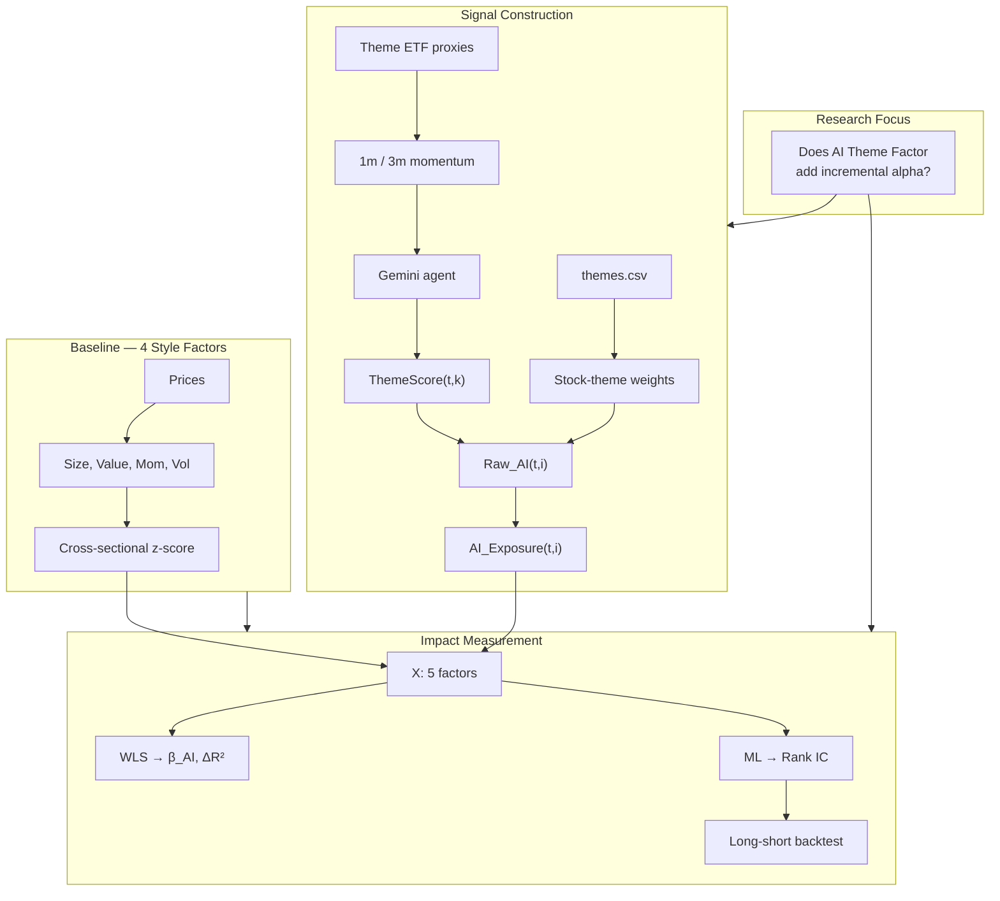
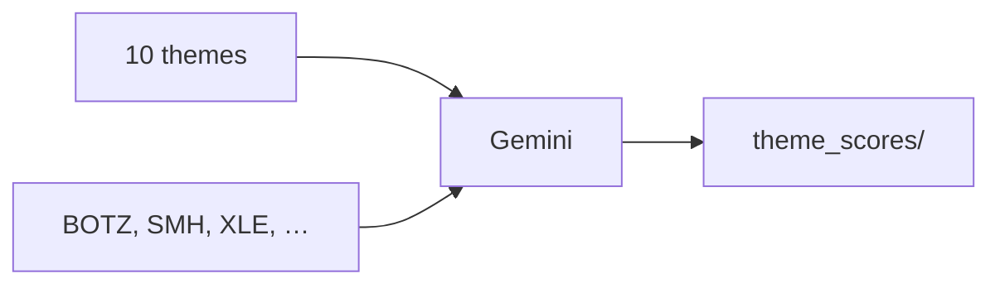

# AI Theme Factor Research

**Can LLM-generated thematic views improve cross-sectional equity return explanation and stock ranking, beyond classical Barra style factors?**

This repo is a **research sandbox** for studying the **AI Theme Factor** — a 5th factor derived from Gemini theme scores and stock-theme mappings, embedded into a Barra-style multi-factor framework alongside Size, Value, Momentum, and Volatility.

The classical factor pipeline (WLS → ML → IC → long-short backtest) provides the **measurement infrastructure**. The research contribution is testing whether **AI-driven thematic signals** add incremental explanatory and predictive power.

> **Scope**: Educational / portfolio project. Not a production risk model. PnL figures are illustrative; research design and limitations are documented explicitly.

---

## Core Research Question

> *When an LLM agent scores investment themes (AI, Semiconductors, Energy, …), does mapping those scores to individual stocks — via thematic exposure weights — produce a tradable factor that (a) earns a positive risk premium in WLS, (b) is orthogonal to Momentum, and (c) improves out-of-sample Rank IC when added to a 4-factor model?*

### Sub-questions

| # | Question | How we test it |
|---|----------|----------------|
| H1 | Does the AI Theme Factor have a positive **factor premium** (β_AI)? | 5-factor WLS: `r_i − r_SPY = X·β + ε` |
| H2 | Is it **orthogonal** to classical factors? | Factor exposure correlation matrix; especially vs. Momentum |
| H3 | Does it add **incremental R²** over 4 factors? | Compare cross-sectional R²: 4-factor vs. 5-factor WLS |
| H4 | Does it improve **stock ranking** (Rank IC)? | Ridge 4-factor vs. Ridge 5-factor on forward excess return |
| H5 | Does **Gemini** beat a naive **ETF-momentum** baseline? | Compare `theme_agent.py` vs. `--mock` scores |

---

## The AI Theme Factor

### Definition

**Step 1 — Theme scores** (daily, cross-sectional view on themes):

```
ThemeScore(t, k) ∈ [-1, +1]     # Gemini agent or ETF-momentum proxy
```

**Step 2 — Stock thematic exposure** (from `themes.csv`):

```
Raw_AI(t, i) = Σ_k  weight(i, k) × ThemeScore(t, k)
```

Each stock can map to multiple themes with weights summing to 1. Example: NVDA → 55% AI + 45% Semiconductors.

**Step 3 — Cross-sectional standardization** (same as style factors):

```
AI_Exposure(t, i) = z-score_i( Raw_AI(t, ·) )
```

**Step 4 — Embed in Barra WLS** as the 5th column of X:

```
r_i − r_SPY ≈ β_Size·X_Size + β_Value·X_Value + β_Mom·X_Mom + β_Vol·X_Vol + β_AI·X_AI + ε_i
```

A positive, stable **β_AI** means high-AI-exposure stocks earn excess returns beyond what the four style factors explain — the thematic signal carries incremental premium.

### Why themes + LLM, not raw ML predictions?

| Approach | Interpretability | Research story |
|----------|------------------|----------------|
| ML ŷ as 5th factor | Low (black box) | "Does the model embed in Barra?" |
| **Theme scores → exposure** | High (which themes drive exposure) | "Can LLM thematic views add alpha in a factor framework?" |

The theme layer separates **view generation** (Gemini scores macro/industry themes) from **position mapping** (static weights in `themes.csv`) from **factor estimation** (WLS). Each step is auditable — important for quant research interviews.

---

## Research Architecture



### Implementation status

| Component | Status | Module |
|-----------|--------|--------|
| Stock-theme mapping (50 stocks × 10 themes) | ✅ Done | `themes.csv` |
| Gemini theme scoring + ETF context | ✅ Done | `theme_agent.py` |
| ETF-momentum baseline (`--mock`) | ✅ Done | `theme_agent.py` |
| Daily score persistence | ✅ Done | `theme_scores/*.json` |
| Stock AI exposure panel | 🔲 Next | `ai_factor.py` |
| 5-factor WLS (β_AI, ΔR²) | 🔲 Next | `barra_panel.py` |
| 5-factor ML (incremental Rank IC) | 🔲 Next | `ml_predict.py` |
| Historical theme score panel | 🔲 Next | batch `--mock` or cached Gemini |

---

## Theme Agent (`theme_agent.py`)

The agent is the **view-generation layer** for the AI Theme Factor.

### Workflow

1. Load 10 themes from `themes.csv`
2. Fetch ETF proxy returns (1m / 3m) as grounding context
3. Prompt Gemini to score each theme ∈ [-1, +1]
4. Save structured JSON to `theme_scores/YYYY-MM-DD.json`



### Theme → ETF proxies

| Theme | ETF | Theme | ETF |
|-------|-----|-------|-----|
| AI | BOTZ | Healthcare | XLV |
| Cloud | WCLD | Financials | XLF |
| Semiconductors | SMH | Consumer | XLY |
| Software | IGV | Energy | XLE |
| Media | XLC | Industrials | XLI |

### Example: Gemini scores (2026-06-19)

| Theme | Score | ETF 3m return | Interpretation |
|-------|-------|---------------|----------------|
| Semiconductors | **+0.90** | +58.0% | Strongest bullish view |
| Energy | **−0.80** | −7.3% | Bearish, aligned with weak XLE |
| Financials | +0.70 | +10.9% | Bullish |
| AI | +0.50 | +7.8% | Moderately bullish |

Gemini differentiates themes beyond raw momentum (e.g. Software +0.1 despite +5.6% ETF return) — the research question is whether this differentiation improves stock-level factor quality.

### CLI

```bash
python theme_agent.py                  # Gemini (reads .env)
python theme_agent.py --date 2026-06-19
python theme_agent.py --mock           # reproducible ETF proxy baseline
```

### Baseline for H5

`--mock` z-scores ETF 3-month returns across themes → [-1, +1]. This is the **null hypothesis** for the LLM: if Gemini cannot beat mock on Rank IC or β_AI stability, the agent adds no value over naive momentum.

---

## Foundation Pipeline

The 4-factor Barra + ML stack is the **control framework** against which AI Theme Factor impact is measured.

### Style factors (4)

| Factor | Construction |
|--------|--------------|
| Size | `ln(price)` |
| Value | `book_per_share / price` (P/B proxy) |
| Momentum | 63d cumulative return, skip last 5d |
| Volatility | 20d rolling return std |

### WLS factor returns

```
β = (Xᵀ W X)⁻¹ Xᵀ W y        W = diag(ln(marketCap))
```

### ML alpha (4-factor baseline results)

Chronological 80/20 split, 50 large caps, 2016–2026:

```
                          mean_ic  mean_rank_ic  sharpe
Ridge (4 factors)          0.0730        0.0546    1.95
Momentum only (OLS)        0.0246        0.0216    0.80
Baseline (predict 0)          NaN           NaN   -1.86
```

**This is the bar the 5-factor model must beat.** Adding AI Theme Factor is meaningful only if Ridge (5 factors) improves Rank IC over Ridge (4 factors), and β_AI is positive and not fully explained by Momentum correlation.

### Entry points

| Script | Role |
|--------|------|
| `theme_agent.py` | **AI Theme Factor signal** — score themes |
| `barra_panel.py` | Factor panel + WLS (will extend to 5 factors) |
| `ml_predict.py` | ML comparison + Rank IC + backtest |
| `barra.py` | Static WLS demo |
| `backtest.py` | Long-short portfolio simulation |

---

## How We Measure AI Theme Factor Impact

Once `ai_factor.py` is integrated, the evaluation protocol:

### 1. Factor premium (H1)

Run 5-factor WLS daily; track **β_AI** time series.

- Mean β_AI > 0?
- Stable across subperiods?

### 2. Orthogonality (H2)

```
corr(AI_Exposure, Momentum)   ← key risk: theme factor ≈ momentum in disguise
corr(AI_Exposure, Size/Value/Vol)
```

If corr(AI, Momentum) > 0.7, residualize AI against Momentum before WLS.

### 3. Incremental explanatory power (H3)

```
ΔR² = R²(5-factor WLS) − R²(4-factor WLS)     per cross-section date, then average
```

### 4. Incremental predictive power (H4)

```
Rank IC( Ridge 5-factor )  vs.  Rank IC( Ridge 4-factor )     on test set
```

### 5. LLM value-add (H5)

```
Rank IC( Gemini scores )  vs.  Rank IC( --mock scores )
```

---

## Project Structure

```
ai_factor_barra/
├── themes.csv           # Stock → theme weights (input to AI exposure)
├── theme_agent.py       # Gemini agent: theme scores
├── theme_scores/        # Daily score snapshots
├── ai_factor.py         # [next] theme scores → stock AI exposure panel
├── features.py          # 4 style factors + z-score
├── barra_panel.py       # WLS factor return estimation
├── ml_predict.py        # ML alpha + Rank IC + backtest
├── backtest.py          # Long-short simulation
├── config.py            # Universe, windows, Gemini model
├── env_loader.py        # Load GEMINI_API_KEY from .env
├── .env.example
└── requirements.txt
```

---

## Setup & Run

```bash
python3 -m venv .venv && source .venv/bin/activate
pip install -r requirements.txt

cp .env.example .env
# Add GEMINI_API_KEY=...  (https://aistudio.google.com/apikey)
# Use API model ID in config.py, e.g. gemini-2.5-flash-lite

python theme_agent.py              # generate today's theme scores
python theme_agent.py --mock       # ETF baseline, no API key
python barra_panel.py              # 4-factor WLS (baseline)
python ml_predict.py               # 4-factor ML (baseline)
```

---

## Configuration

| Parameter | Default | Role in AI Theme research |
|-----------|---------|---------------------------|
| `THEMES_FILE` | `themes.csv` | Stock-theme exposure weights |
| `GEMINI_MODEL` | `gemini-2.5-flash-lite` | LLM for theme scoring |
| `THEME_ETF_PROXY` | BOTZ, SMH, … | Grounding context for agent |
| `THEME_SCORES_DIR` | `theme_scores` | Point-in-time score archive |
| `FACTOR_NAMES` | 4 style factors | Will add `"AI"` after integration |
| `TICKERS` | 50 large caps | Research universe |
| `FORWARD_DAYS` | 5 | ML label horizon for Rank IC test |

---

## Known Limitations

| Issue | Impact on AI Theme research | Mitigation |
|-------|----------------------------|------------|
| Static `themes.csv` | NVDA always "AI" — no business model drift | Point-in-time thematic tags in production |
| Point-in-time Gemini scores only | Cannot backtest β_AI history yet | Batch `--mock` for reproducible panel; cache Gemini daily |
| Theme ↔ Momentum overlap | AI factor may duplicate Mom | Report correlation; residualize if needed |
| 50-stock universe | Small cross-section, noisy β_AI | Acknowledge; focus on methodology not PnL |
| No transaction costs | Overstates LS returns | Report gross; discuss net in interview |
| Single ML train/test split | One-regime OOS | Walk-forward as extension |

---

## Interview Talking Points

**Elevator pitch (30 sec):**

> I built a Barra-style factor research pipeline to test whether LLM-generated thematic views add incremental alpha. A Gemini agent scores 10 investment themes daily; stock AI exposure is a weighted sum of those scores. I measure impact via β_AI in WLS, orthogonality to Momentum, ΔR², and incremental Rank IC over a 4-factor baseline.

**Expected questions:**

- **What is the AI Theme Factor?** Not a black-box ML prediction — it's `Σ weight(i,theme) × GeminiScore(theme)`, z-scored cross-sectionally, embedded as a 5th Barra factor.
- **How do you backtest an LLM signal?** Gemini for live views; `--mock` ETF proxy for reproducible historical panels. Compare both.
- **What if AI factor correlates with Momentum?** Expected for AI/Semiconductor themes in 2024–25. I'd report correlation, residualize, and check if β_AI survives.
- **Why themes instead of direct LLM stock picks?** Themes are more stable, interpretable, and map cleanly to a factor exposure framework — closer to how systematic shops embed alternative data.
- **What's not built yet?** `ai_factor.py` integration and historical score panel — the measurement protocol is defined, implementation is next.

---

## License

Personal / educational use.
