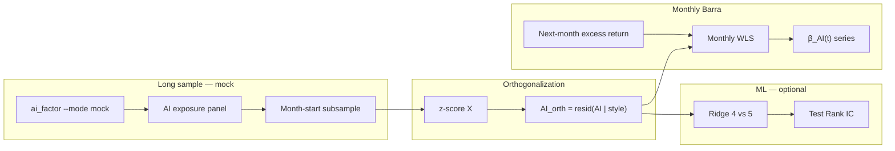
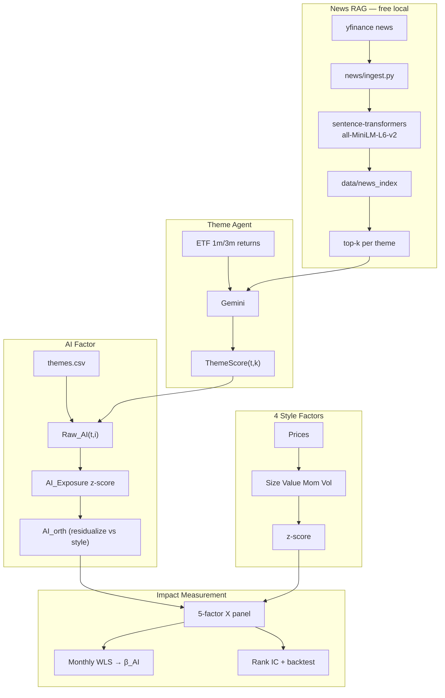
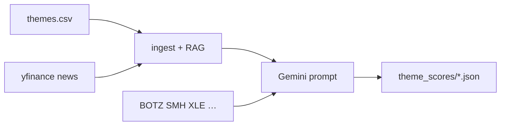

# AI Theme Factor Research

**Can LLM + RAG-enhanced thematic views improve cross-sectional equity return explanation and stock ranking, beyond classical Barra style factors?**

This repo is a **research sandbox** for studying the **AI Theme Factor** — a 5th factor derived from Gemini theme scores (grounded in ETF momentum and RAG-retrieved news) and stock-theme mappings, embedded into a Barra-style multi-factor framework alongside Size, Value, Momentum, and Volatility.

The classical factor pipeline (WLS → ML → IC → long-short backtest) provides the **measurement infrastructure**. The research contribution is testing whether **AI-driven thematic signals** add incremental explanatory and predictive power.

> **Scope**: Educational / portfolio project. Not a production risk model. PnL figures are illustrative; research design and limitations are documented explicitly.

---

## Core Research Question

> *When an LLM agent scores investment themes (AI, Semiconductors, Energy, …) using ETF context and RAG-retrieved news, does mapping those scores to individual stocks — via thematic exposure weights — produce a factor that (a) earns a positive risk premium in WLS, (b) is orthogonal to Momentum, and (c) improves out-of-sample Rank IC when added to a 4-factor model?*

### Sub-questions

| # | Question | How we test it |
|---|----------|----------------|
| H1 | Does the AI Theme Factor have a positive **factor premium** (β_AI)? | **Monthly** 5-factor WLS on long mock sample: `r_i − r_SPY = X·β + ε` |
| H2 | Is it **orthogonal** to classical factors? | Exposure corr matrix; **`AI_orth`** residualized vs. Size/Value/Mom/Vol |
| H3 | Does it add **incremental R²** over 4 factors? | Monthly cross-sectional R²: 4-factor vs. 5-factor WLS |
| H4 | Does it improve **stock ranking** (Rank IC)? | Ridge 4-factor vs. Ridge 5-factor on forward excess return |
| H5 | Does **Gemini + RAG** beat a naive **ETF-momentum** baseline? | Compare `theme_agent.py` vs. `--mock` scores |

---

## Research Roadmap (current plan)

We **cannot obtain ~10 years of real LLM theme scores** (yfinance news has no historical archive; Gemini+RAG is live/recent only). The plan is to run **monthly Barra WLS** on a long sample with a reproducible proxy, **orthogonalize AI against classical style factors** to isolate incremental impact, and keep a separate short sample for true Gemini scores.

### Two-sample design

| Track | Period | AI signal | Purpose |
|-------|--------|-----------|---------|
| **Long sample** | 2016–2026 | `ai_factor.py --mode mock` (ETF 3m theme proxy) | Stable **β_AI** time series, orthogonality, ΔR² over many months |
| **Short sample** | Recent dates w/ `theme_scores/*.json` | `ai_factor.py --mode auto` (Gemini+RAG where available) | H5: does LLM beat mock on Rank IC / β_AI on the same dates? |

Do **not** label mock long-sample results as “10-year LLM alpha” — they validate the **thematic exposure + Barra framework**; Gemini value-add is tested only where JSON scores exist.

### Monthly Barra (`barra_monthly.py` — planned)

Keep [`barra.py`](barra.py) as a **single-day static WLS demo**. Add a new script **`barra_monthly.py`** for the main factor-premium study:

| Choice | Definition |
|--------|------------|
| Rebalance dates | **First trading day of each month** (aligned with `backtest.py` `REBALANCE_FREQ = "monthly"`) |
| **Y** | **Next month** cumulative excess return vs. SPY (compound daily excess over that month) |
| **X** | Size, Value, Momentum, Volatility at rebalance date `t`; AI from `build_ai_panel` subsampled to month-starts |
| Estimation | Cross-sectional WLS per month: `β = (Xᵀ W X)⁻¹ Xᵀ W y`, `W = diag(ln(marketCap))` |
| Output | Monthly factor return series → mean(β_AI), t-stat, ΔR² vs. 4-factor |

Reuse [`features.py`](features.py) for style factors, [`ai_factor.py`](ai_factor.py) for the AI panel, and the WLS formula from [`barra.py`](barra.py).

### AI orthogonalization (planned)

Theme scores (mock or Gemini) overlap **Momentum** and other style factors. Before monthly WLS, residualize AI on each rebalance cross-section:

```
AI_orth(i,t) = AI(i,t) − α(t) − γ(t)ᵀ · [Size, Value, Momentum, Volatility](i,t)
```

Then z-score `AI_orth` cross-sectionally and use it as the 5th column of **X** (replacing raw AI).

| Step | Action |
|------|--------|
| 1 | Build raw style factors + raw AI exposure at month-start `t` |
| 2 | Cross-sectional z-score all columns |
| 3 | OLS: `AI ~ Size + Value + Momentum + Volatility` (with intercept) → residuals |
| 4 | Z-score residuals → `AI_orth` |
| 5 | WLS with `[Size, Value, Momentum, Volatility, AI_orth]` |

**Why:** Multivariate WLS already gives a partial β_AI, but correlated exposures make estimates unstable. Orthogonalization makes **H2** explicit (`corr(AI_orth, Momentum) ≈ 0`) and clarifies that β_AI is **incremental to style**, not a momentum re-label.

Report both: (a) exposure correlation matrix **before** orthogonalization, (b) WLS results **after** `AI_orth`.

### End-to-end workflow (target)



### Script roles (after roadmap)

| Script | Role |
|--------|------|
| `barra.py` | Unchanged — single-day WLS snapshot / teaching demo |
| `barra_panel.py` | Daily factor panel + single-date WLS |
| **`barra_monthly.py`** | **Planned** — monthly WLS loop, AI orthogonalization, β time series |
| `ml_predict.py` | OOS Rank IC; optionally swap in `AI_orth` for Ridge(5) |

---

## The AI Theme Factor

### Definition

**Step 1 — Theme scores** (daily, cross-sectional view on themes):

```
ThemeScore(t, k) ∈ [-1, +1]     # Gemini + RAG + ETF context, or --mock proxy
```

**Step 2 — Stock thematic exposure** (from `themes.csv`):

```
Raw_AI(t, i) = Σ_k  weight(i, k) × ThemeScore(t, k)
```

Each stock can map to multiple themes with weights summing to 1. Example: NVDA → 55% AI + 45% Semiconductors.

**Step 3 — Cross-sectional standardization** (same as style factors):

```
AI_Exposure(t, i) = z-score_i( Raw_AI(t, ·) )
```

**Step 3b — Orthogonalization** (monthly Barra plan; optional in daily ML):

```
AI_orth(t, i) = AI_Exposure(t, i) − projection onto [Size, Value, Momentum, Volatility] at t
```

**Step 4 — Embed in Barra WLS** as the 5th column of X:

```
r_i − r_SPY ≈ β_Size·X_Size + β_Value·X_Value + β_Mom·X_Mom + β_Vol·X_Vol + β_AI·X_AI_orth + ε_i
```

A positive, stable **β_AI** on **AI_orth** means thematic exposure earns excess returns **after removing overlap with classical style factors**.

### Why themes + LLM + RAG?

| Layer | Role |
|-------|------|
| **RAG (local)** | Retrieve theme-relevant news headlines — free, no embedding API |
| **Gemini** | Synthesize ETF momentum + news into theme scores |
| **`themes.csv`** | Map theme views to stock exposures |
| **Barra WLS / ML** | Measure incremental premium and Rank IC |

The pipeline separates **information retrieval** (RAG), **view generation** (Gemini), **position mapping** (weights), and **factor estimation** (WLS) — each step is auditable.

---

## Research Architecture



### Implementation status

| Component | Status | Module |
|-----------|--------|--------|
| Stock-theme mapping (50 stocks × 10 themes) | ✅ Done | `themes.csv` |
| yfinance news ingest per theme | ✅ Done | `news/ingest.py` |
| Local RAG (free embedding + retrieval) | ✅ Done | `news/rag.py` |
| Gemini scoring + RAG in prompt | ✅ Done | `theme_agent.py` |
| ETF-momentum baseline (`--mock`) | ✅ Done | `theme_agent.py` |
| Daily score + news citation persistence | ✅ Done | `theme_scores/*.json` |
| Stock AI exposure panel | ✅ Done | `ai_factor.py` |
| Mock theme score panel (full history) | ✅ Done | `ai_factor.py` (`--mode mock`) |
| Daily 5-factor WLS snapshot | ✅ Done | `barra.py` |
| Daily factor panel + WLS | ✅ Done | `barra_panel.py` |
| 5-factor ML + Rank IC | ✅ Done | `ml_predict.py` |
| **Monthly Barra WLS + β_AI time series** | 🔲 Planned | `barra_monthly.py` |
| **AI orthogonalization vs style factors** | 🔲 Planned | `barra_monthly.py` / `features.py` |
| Ridge(5) with `AI_orth` (incremental Rank IC) | 🔲 Planned | `ml_predict.py` |

---

## News RAG Pipeline (free — no paid embedding API)

### `news/ingest.py` — collect headlines

1. Look up tickers per theme from `themes.csv` (e.g. AI → NVDA, MSFT, AMD…)
2. Fetch recent headlines via `yfinance.Ticker(t).news`
3. Deduplicate by title; filter to `NEWS_LOOKBACK_DAYS` (default 7) before `as_of`

### `news/rag.py` — retrieve top-k per theme

1. Embed headlines with **local** `sentence-transformers` (`all-MiniLM-L6-v2`)
2. Query each theme: `"{theme} sector investment outlook stock market news"`
3. Cosine similarity → top-`NEWS_RAG_TOP_K` (default 5) articles per theme
4. Cache index under `data/news_index/YYYY-MM-DD/` (JSON + `.npy` vectors)

```bash
python news/ingest.py    # smoke test: fetch headlines
python news/rag.py       # build index + print retrieval results
```

**Cost**: embedding runs locally after first model download — no OpenAI/Gemini embedding API.

**Limitation**: yfinance news has no full historical archive; RAG is for **live / recent** scoring. Historical backtests use `--mock` ETF proxy scores.

---

## Theme Agent (`theme_agent.py`)

Combines **ETF context**, **RAG news**, and **Gemini** to produce daily theme scores.

### Workflow



1. Fetch ETF proxy returns (1m / 3m) per theme
2. Build or load cached RAG index; retrieve top-k news per theme
3. Prompt Gemini with ETF data + headlines
4. Save JSON with `scores`, `context`, and `news_sources`

### CLI

```bash
python theme_agent.py                  # Gemini + RAG + ETF (default)
python theme_agent.py --date 2026-06-19
python theme_agent.py --no-news        # Gemini + ETF only (A/B vs RAG)
python theme_agent.py --rebuild-news   # force rebuild news index
python theme_agent.py --mock           # ETF proxy baseline, no API key
```

Requires `GEMINI_API_KEY` in `.env` (see `.env.example`). Use API model ID in `config.py` (e.g. `gemini-2.5-flash-lite`), not the UI display name.

### Example output (`theme_scores/2026-06-19.json`, source: `gemini_rag`)

| Theme | Score | Notes |
|-------|-------|-------|
| Semiconductors | **+0.80** | Bullish; strong SMH momentum |
| Industrials | +0.60 | |
| Energy | **−0.60** | Bearish; weak XLE |
| Media | −0.40 | |
| Software | 0.00 | Neutral despite positive ETF — Gemini ≠ pure momentum |

JSON also includes `news_sources` with cited headlines per theme for interview demos.

### Baseline for H5

`--mock` z-scores ETF 3-month returns across themes → [-1, +1]. If Gemini+RAG cannot beat mock on Rank IC or β_AI stability, the LLM layer adds no value over naive theme momentum.

---

## AI Factor in Barra (integrated)

Theme scores map to stocks via [`ai_factor.py`](ai_factor.py) and merge with style factors in [`features.py`](features.py):

```python
# Long history: mock ETF proxy
python ai_factor.py --mode mock --rebuild

# Recent dates: Gemini JSON when present, else mock
python ai_factor.py --mode auto --rebuild

# Panel used by barra_panel.py / ml_predict.py
ai_panel = build_ai_panel(dates=returns.index, mode="mock")
x_panel = zscore_cross_section(build_factor_panel(returns, close, ai_panel=ai_panel))
```

**Next:** [`barra_monthly.py`](barra_monthly.py) — month-start subsample, `AI_orth`, next-month **Y**, rolling WLS → β_AI series (see [Research Roadmap](#research-roadmap-current-plan)).

---

## Foundation Pipeline

The 4-factor Barra + ML stack is the **control framework** against which AI Theme Factor impact is measured.

### Style factors (4)

| Factor | Construction |
|--------|--------------|
| Size | `ln(price)` |
| Value | `book_per_share / price` (P/B proxy) |
| Momentum | 63d cumulative return, skip last 5d |
| Volatility | 20d rolling return std |

### WLS factor returns

```
β = (Xᵀ W X)⁻¹ Xᵀ W y        W = diag(ln(marketCap))
```

### ML alpha (4-factor baseline results)

Chronological 80/20 split, 50 large caps, 2016–2026:

```
                          mean_ic  mean_rank_ic  sharpe
Ridge (4 factors)          0.0730        0.0546    1.95
Momentum only (OLS)        0.0246        0.0216    0.80
Baseline (predict 0)          NaN           NaN   -1.86
```

**This is the bar the 5-factor model must beat.**

### Entry points

| Script | Role |
|--------|------|
| `news/ingest.py` | Fetch yfinance news per theme |
| `news/rag.py` | Local embedding RAG index + retrieval |
| `theme_agent.py` | **Signal** — Gemini + RAG theme scores |
| `barra_panel.py` | Daily factor panel + WLS |
| `barra_monthly.py` | **Planned** — monthly WLS, AI orth, β time series |
| `ml_predict.py` | ML comparison + Rank IC + backtest |
| `barra.py` | Single-day static WLS demo (unchanged) |
| `backtest.py` | Long-short portfolio simulation |

---

## How We Measure AI Theme Factor Impact

| Test | Metric | Module |
|------|--------|--------|
| H1 Factor premium | Mean **β_AI** from **monthly** 5-factor WLS (long mock sample) | `barra_monthly.py` |
| H2 Orthogonality | `corr(AI, Momentum)` before orth; **`corr(AI_orth, Momentum) ≈ 0`** after | `barra_monthly.py` |
| H3 Incremental R² | `R²(5-factor) − R²(4-factor)` per month | `barra_monthly.py` |
| H4 Predictive power | Test **Rank IC**: Ridge(5) vs Ridge(4); optional **AI_orth** | `ml_predict.py` |
| H5 LLM value-add | Gemini+RAG vs `--mock` on dates with `theme_scores/*.json` | `theme_agent.py` + `ml_predict.py` |

---

## Project Structure

```
ai_factor_barra/
│
├── config.py                 # Global settings: universe, dates, factor names, RAG/agent params
├── env_loader.py             # Load GEMINI_API_KEY from .env
├── .env.example              # API key template (copy to .env)
├── requirements.txt
├── .gitignore
│
├── themes.csv                # Stock → theme exposure weights (50 stocks × 10 themes)
│
├── theme_agent.py            # Gemini + RAG + ETF → daily theme scores
├── theme_scores/             # Persisted theme score JSON (scores, context, news_sources)
│   └── YYYY-MM-DD.json
│
├── news/                     # Free local news RAG (no paid embedding API)
│   ├── __init__.py
│   ├── ingest.py             # Fetch yfinance headlines per theme
│   └── rag.py                # sentence-transformers embed + cosine retrieval
│
├── ai_factor.py              # Theme scores → stock-level AI exposure panel
├── features.py               # Style factors (Size/Value/Mom/Vol) + cross-section z-score
│
├── barra.py                  # Single-day 5-factor WLS demo (static X from yfinance info)
├── barra_panel.py            # Rolling daily factor panel + 5-factor WLS
├── barra_monthly.py          # (planned) Monthly WLS, AI orth, β_AI time series
├── ml_predict.py             # Ridge/RF models, Rank IC, long-short backtest
├── backtest.py               # Long-short portfolio simulation (used by ml_predict)
│
└── data/                     # Generated caches (gitignored)
    ├── news_index/           # RAG embeddings per as-of date
    │   └── YYYY-MM-DD/
    │       ├── meta.json
    │       ├── AI.json / AI.npy
    │       └── …             # one JSON + .npy per theme
    └── ai_exposure_panel.parquet   # (date, ticker) × AI raw exposure panel
```

### Module roles

| Path | Role |
|------|------|
| `themes.csv` | Static stock–theme weights; input to AI exposure mapping |
| `theme_agent.py` | **Signal layer** — LLM theme scores with RAG + ETF context |
| `theme_scores/` | Auditable archive of daily Gemini/mock scores |
| `news/ingest.py` | Pull and normalize yfinance news by theme |
| `news/rag.py` | Local embedding index + top-k retrieval per theme |
| `ai_factor.py` | Map theme scores → per-stock `Raw_AI`; cache parquet panel |
| `features.py` | Build 4 style factors; merge AI panel; z-score cross-section |
| `barra.py` | Quick single-date WLS including `AI_Return` (demo only) |
| `barra_panel.py` | Daily factor panel + single-date WLS |
| `barra_monthly.py` | **Planned** — monthly WLS loop, AI_orth, factor return time series |
| `ml_predict.py` | ML alpha test: Ridge(4) vs Ridge(5), Rank IC, backtest |
| `backtest.py` | Monthly long-short simulation helpers |
| `config.py` | `FACTOR_NAMES`, dates, `AI_SCORE_MODE`, RAG params |
| `data/news_index/` | Cached RAG vectors (rebuilt by `theme_agent` or `news/rag.py`) |
| `data/ai_exposure_panel.parquet` | Cached AI panel for `barra_panel` / `ml_predict` |

### Recommended run order

```bash
# 1. Theme scoring (optional — skip if using --mode mock)
python theme_agent.py --date YYYY-MM-DD

# 2. Build AI exposure panel
python ai_factor.py --mode auto --rebuild    # Gemini JSON where available, else mock
# python ai_factor.py --mode mock --rebuild  # full-history mock baseline

# 3. Factor research (any order)
python barra.py              # single-day WLS snapshot (demo)
python barra_panel.py          # daily panel + WLS
python barra_monthly.py        # (planned) monthly WLS + AI orth + β series
python ml_predict.py           # ML comparison + Rank IC
```

---

## Setup & Run

```bash
python3 -m venv .venv && source .venv/bin/activate
pip install -r requirements.txt

cp .env.example .env
# GEMINI_API_KEY=...  https://aistudio.google.com/apikey

# --- AI Theme signal ---
python news/rag.py                 # build local RAG index (optional standalone test)
python theme_agent.py              # Gemini + RAG + ETF → theme_scores/
python theme_agent.py --mock       # reproducible baseline, no API key

# --- Factor research ---
python barra_panel.py              # daily panel + WLS
python barra_monthly.py            # (planned) monthly WLS + AI orth
python ml_predict.py                 # ML + Rank IC (Ridge 4 vs 5)
```

First run downloads `all-MiniLM-L6-v2` (~80 MB) for local embedding. `ml_predict.py` first run is slow (50 tickers × yfinance info for Value factor).

---

## Configuration

| Parameter | Default | Role |
|-----------|---------|------|
| `THEMES_FILE` | `themes.csv` | Stock-theme exposure weights |
| `GEMINI_MODEL` | `gemini-2.5-flash-lite` | LLM for theme scoring |
| `THEME_ETF_PROXY` | BOTZ, SMH, … | ETF context in agent prompt |
| `THEME_SCORES_DIR` | `theme_scores` | Daily score archive |
| `NEWS_LOOKBACK_DAYS` | 7 | News date filter |
| `NEWS_RAG_TOP_K` | 5 | Headlines per theme in prompt |
| `EMBEDDING_MODEL` | `all-MiniLM-L6-v2` | Local RAG embedding (free) |
| `NEWS_INDEX_DIR` | `data/news_index` | RAG cache |
| `FACTOR_NAMES` | 5 factors incl. `"AI"` | Style + AI exposure |
| `REBALANCE_FREQ` | `monthly` | Aligns with `barra_monthly.py` and `backtest.py` |
| `AI_SCORE_MODE` | `auto` | `mock` for long history; `auto` uses Gemini JSON when present |
| `FORWARD_DAYS` | 5 | ML label horizon |

---

## Known Limitations

| Issue | Impact | Mitigation |
|-------|--------|------------|
| Static `themes.csv` | Business models don't evolve in data | Point-in-time tags in production |
| yfinance news not historical | RAG only for recent/live dates | `--mock` for backtest panel |
| Generic headlines in RAG | "Stocks rally" hits many themes | Theme-specific tickers + semantic query |
| Theme ↔ Momentum overlap | AI factor may duplicate Mom | Orthogonalize → `AI_orth` before monthly WLS |
| No 10y Gemini history | Cannot backtest LLM views over full sample | Long sample: `--mock`; short sample: Gemini JSON dates |
| 50-stock universe | Noisy β_AI | Focus on methodology; monthly aggregation helps |
| Single ML train/test split | One-regime OOS | Walk-forward as extension |

---

## Interview Talking Points

**Elevator pitch (30 sec):**

> I built a Barra-style research pipeline to test whether LLM thematic views add incremental alpha. A free local RAG layer retrieves theme-relevant news; Gemini scores 10 themes using news + ETF context; stock AI exposure is a weighted sum from `themes.csv`. Because LLM scores lack a 10-year archive, I run **monthly Barra WLS** on a long **mock** sample and **orthogonalize AI against style factors** so β_AI is not just momentum in disguise. I measure impact via β_AI time series, orthogonality, ΔR², and incremental Rank IC over a 4-factor baseline; Gemini value-add is tested on recent scored dates.

**Expected questions:**

- **What is the AI Theme Factor?** `Σ weight(i,theme) × ThemeScore(theme)`, z-scored, embedded as a 5th Barra factor — not a black-box stock picker.
- **How does RAG work here?** yfinance headlines → local MiniLM embedding → cosine retrieval per theme → top headlines in Gemini prompt. No paid embedding API.
- **How do you backtest LLM signals?** Live: Gemini+RAG in `theme_scores/`. Long history: `--mock` ETF proxy — not claimed as LLM alpha. Two-sample design: mock for β_AI stability, Gemini for H5.
- **What if AI correlates with Momentum?** Cross-sectional regression → `AI_orth`, then monthly WLS; report corr before and after.
- **What's next?** Implement `barra_monthly.py` (month-start X, next-month Y, WLS loop); optionally feed `AI_orth` into Ridge(5) in `ml_predict.py`.

---

## License

Personal / educational use.
